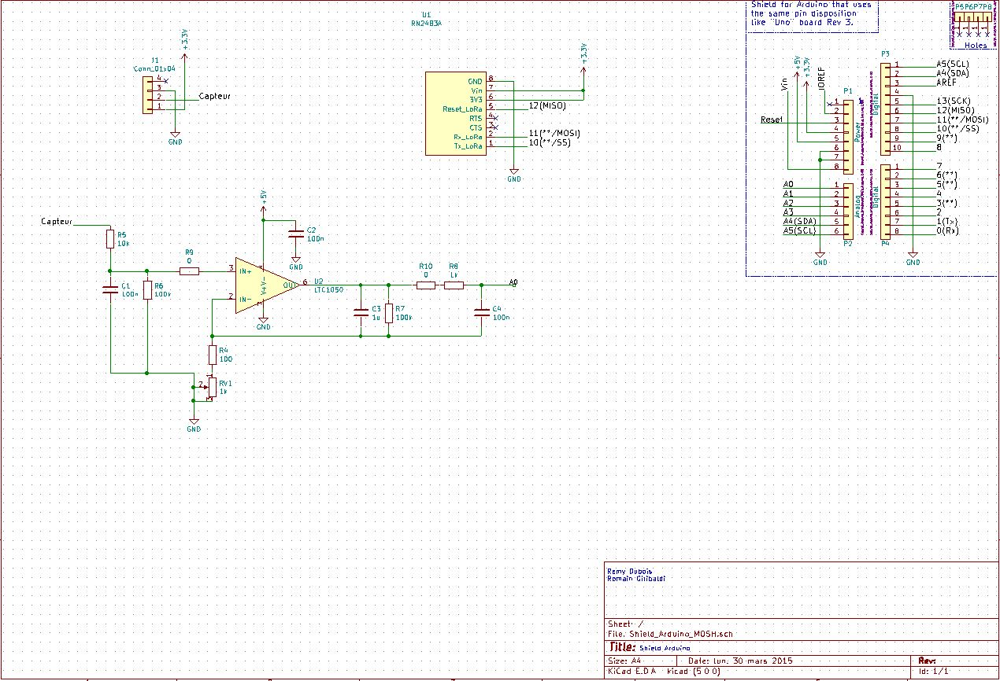
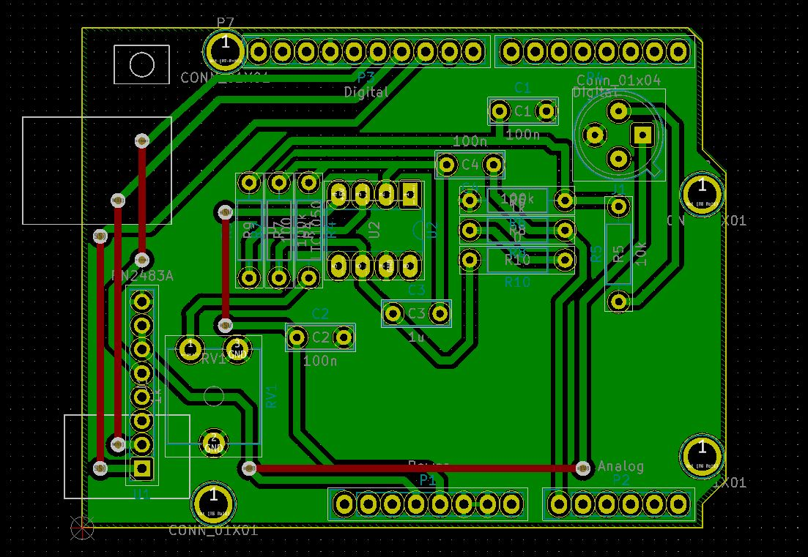
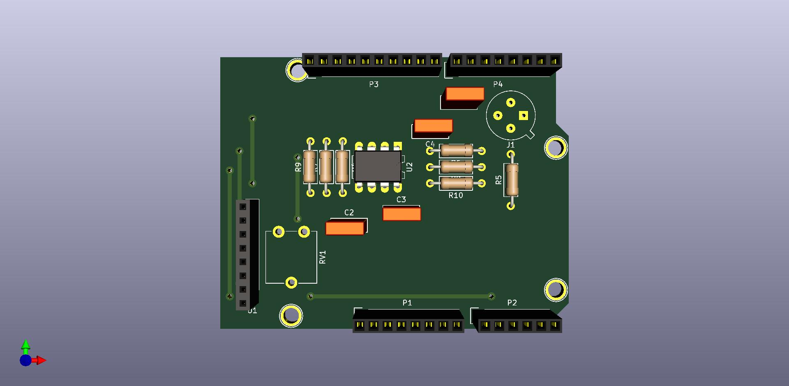

# MOSH_Project: Connected gas Sensor
> GIRIBALDI Romain & DUBOIS Remy

The goal of this project is to build a **connected gas sensor** and build the interface around the sensor.

For this we use an **Arduino Uno** board and connected to it a **RN2483** chip. This chip allows us to send and receive messages from the **LoRa Network**, that we will be able to get on **The Things Network**.

First we build the code to detect gas from the sensor on the Arduino IDE, then we develop an arduino shield that can be pluged on the **Arduino Uno** board, and also the gaz sensor and the **RN2483** chip.

# Hardware Components

- **Arduino Uno** board
- **LT1050** Operational Amplifier 
- **RN2483** Microchip
- **MQ-9 groove Gas Sensor**
- A homemade sensor that will be made later at A.I.M.E.

# Arduino Code 

For the Arduino code we use the **Arduino IDE**, the goal was to detect a threshold exceeded on the gas sensor, first we do our tests with the groove gas sensor but in the end the goal is to use the homemade one. 

The source code is available on the Arduino directory.

## Kicad project
### Overview

The PCB is composed of: 
- **RN2483** chip
- Amplification stage with a **LT1050**
- **TO5** housing for the gas sensor to be created

### Schematic

### PCB Layout

### 3D Visualization

